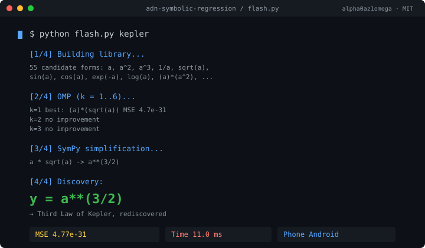

# ADN — Symbolic Regression on Android

A minimal symbolic regression engine that runs on a smartphone.
No PyTorch. No GPU. No cloud. Just NumPy.

It rediscovers mathematical laws from raw numeric data.

## Results

| Target         | Discovered      | MSE      | Time  |
|----------------|-----------------|----------|-------|
| y = x·sin(x)   | y = x*sin(x)    | 5.36e-33 | 18 ms |
| T = a^(3/2)    | y = a**(3/2)    | 4.77e-31 | 11 ms |

The second is the Third Law of Kepler, rediscovered from numeric
data alone, on a phone, in 11 milliseconds.

## Author

**alpha0az1omega**

Built on Termux, Android.
Add animated demo to README
